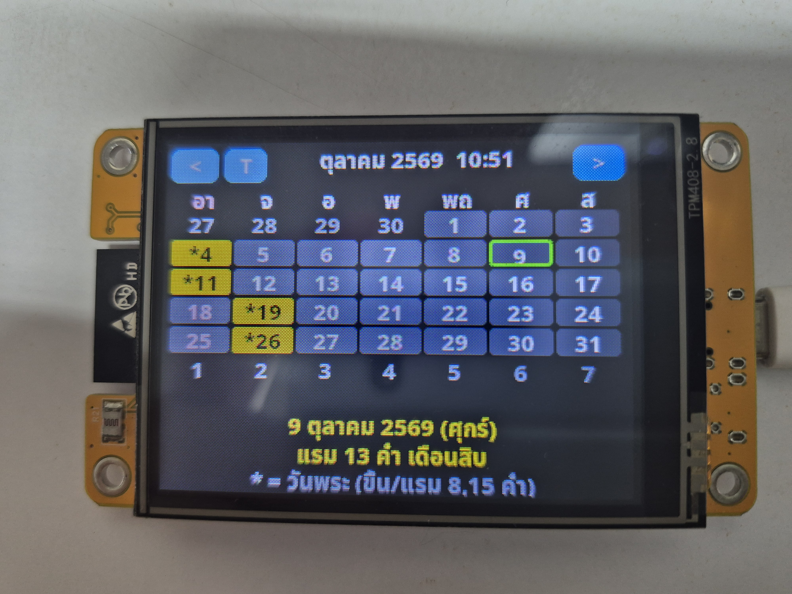

# CYD Thai Lunar Calendar

ปฏิทินจันทรคติไทย + วันพระ บนบอร์ด CYD (ESP32 + ILI9341) ด้วย MicroPython + LVGL9



## Files

- `lunar_calendar.py` — แอปหลัก (UI ปฏิทิน, WiFi/NTP sync เวลา, ธีมสี)
- `thai_lunar.py` — คำนวณจันทรคติไทย/วันพระ
- `synctime.py` — sync เวลาอย่างเดียว (ใช้หลังไฟดับ)
- `main.py` — autorun ตอนบูต (กัน boot-loop)
- `disp_test.py` — เทสต์จออย่างเดียว
- `thai15.bin` — ฟอนต์ไทยสำหรับ LVGL (build จาก `NotoSansThai-Bold.ttf` ด้วย `lv_font_conv`)
- `config_example.py` — ก็อปเป็น `config.py` แล้วใส่ WiFi ของตัวเอง (`config.py` ไม่ขึ้น git)
- `firmware/lvgl_micropy_ESP32_GENERIC-4.bin` — เฟิร์มแวร์ MicroPython + LVGL9 ที่ใช้กับบอร์ดนี้

## Firmware

บอร์ด CYD (ESP32) ต้องแฟลชเฟิร์มแวร์ก่อน (มี LVGL9 + ไดรเวอร์จอในตัว):

```bash
esptool.py --chip esp32 --port /dev/ttyUSB0 write_flash -z 0x1000 firmware/lvgl_micropy_ESP32_GENERIC-4.bin
```

## Run on board

อัปโหลด `lunar_calendar.py` + `thai_lunar.py` + `thai15.bin` + `config.py` ขึ้นบอร์ด แล้วใน Shell พิมพ์ `import lunar_calendar`
